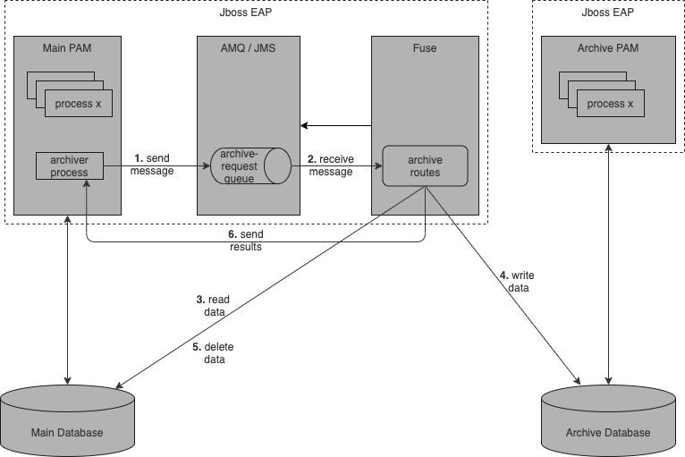

# PAM-Archiver

Prototype of RHPAM process log archiving solution. 

## Architecture

### Components
1. Main PAM - Process Automation Manager for active processes
2. AMQ - messaging platform
3. Fuse - integration platform
4. Main Database - persistent storage for active processes
5. Archive PAM - Process Automation Manager for archived processes
6. Archive Database - persistent storage for archived processes

### Archiver process

1. User starts process manually by setting number of days. All process earlier that number of days will be archived.
2. Process send request to archive-request queue in AMQ through JMS
3. Process wait for archiving termination signal 
4. When signal received Verify Result user task is created with archiving results 

### Archive routes
Archive routes implemented in [PamArchiver](src/main/java/one/entropy/archiver/PamArchiver.java) class

1. Route received message from process
2. Processes archiving
    - Select all finished process older, then days_limit defined by user
    - Save selected processes in archive database (using UPSERT approach)
    - Delete selected processes in main database
    - Save number of process archived
3. Nodes archiving
    - Select all nodes without corresponding processes
    - Save selected nodes in archive database (using UPSERT approach)
    - Delete selected nodes in main database
    - Save number of nodes archived
4. Variables archiving
    - Select all variables without corresponding processes
    - Save selected variables in archive database (using UPSERT approach)
    - Delete selected variables in main database
    - Save number of variables archived    
5. Concatenate saved results
6. Send signal with result to initial process through kie-camel component   

## How to prepare demo

1. Install Jboss EAP 7.3
2. Configure Jboss EAP 7.3
   - create main database Datasource JNDI-name: java:/MainDS
   - create archive database Datasource JNDI-name: java:/ArchiveDS
   - create JMS Queue with name: archive-request and JNDI-name: java:/jms/queue/ArchiveRequest
3. Install RHPAM 7.8 into Jboss EAP
4. Install Fuse 7.8 into Jboss EAP
5. Start Jboss EAP
   - ./bin/standalone.sh -c standalone-full.xml
6. Build and deploy pam-archiver
   -  mvn clean install -Pdeploy 
7. Download and import [ArchiverProcess](https://github.com/mgubaidullin/pam-archiver/releases/download/demo2/MySpace_archiver.zip) into RHPAM
8. Create, deploy, execute and finish few processes 
9. Start ArchiveProcess using Business central
10. When Verify result task created, check main and archive databases